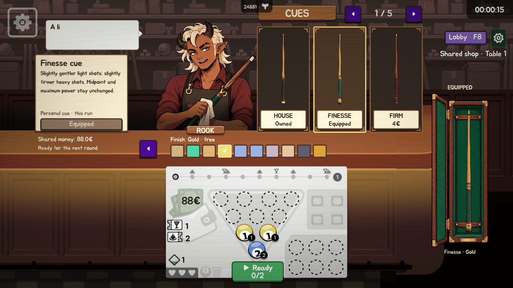

# Rook cue counter — actual native runtime evidence

This gallery records gameplay/fixture commit `bb80925f648d7fe911d56a7df5c41310526b4ca3` for [PR #45](https://github.com/harsh2204/ultrapool-together/pull/45).

**The GIF and screenshots come from the running game. They are not imagegen mockups.** Rook, cue and case source artwork was generated, then loaded and animated by the game. The recording uses native viewport frames after rendering, with fixture callbacks for rack arrows, finish swatches and seller interaction. It contains no generated/interpolated animation frames or composited UI.

The loop shows next/previous rack slides, Rook's idle/blink/talk/nudge states, and finish previews while the equipped case remains Finesse / Gold. The 96 recorded frames cover about 7.94 seconds; encoder/GIF timing quantization and a terminal frame produce an eight-second loop. Output is 1280×720 with palette conversion only.

Run `20260927T104101Z-rook-animation`: **2,175/2,175 harness checks**, **79 native screenshots**, one muted isolated process, 30 FPS cap, 180-second watchdog, normal exit, no script errors, unchanged installed files and normal saves. Existing engine shutdown resource warnings remain. Embedded cue probes report another 226 catalog/curve, 189 inventory and 204 effect checks. This is fixture rendering/callback evidence, not a recorded human session, live networking or foreground performance measurement.

- [Download the complete native screenshot gallery](complete-native-gallery.zip), then open its `index.html`.
- [Verification summary](verification.json), [frame timestamps and animation state](manifest.json), [encoding details](encoding.json), [file hashes](files.json).
- [Host equipment](cue-shop-host-equipped.png), [preview](cue-shop-host-preview.png), [native snack counter](shop-snacks.png), [equipped cue on the table](cue-native-bankshot.png).
- [Rack 1](cue-shop-rack-1.png), [rack 2](cue-shop-rack-2.png), [rack 3](cue-shop-rack-3.png), [rack 4](cue-shop-rack-4.png), [rack 5](cue-shop-rack-5.png).
- [Guest pending](cue-shop-guest-pending.png), [rejected](cue-shop-guest-rejected.png), [confirmed](cue-shop-guest-equipped.png).

The first Rook capture revealed a case texture overflowing its fitted parent; this corrected run includes the production fix and assertions for actual artwork bounds. Narrow/portrait geometry assertions pass without resizing the actual window; rendering and readability at those window sizes remain open. Live simultaneous shoppers, delayed/reordered network delivery, Windows/macOS parity, responsiveness and balance measurements remain separate acceptance work.
