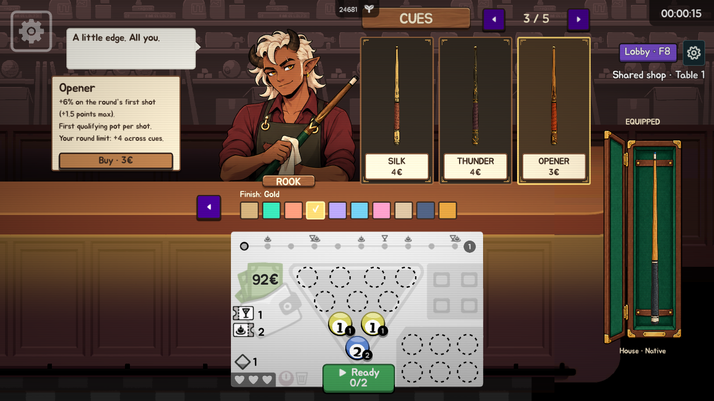
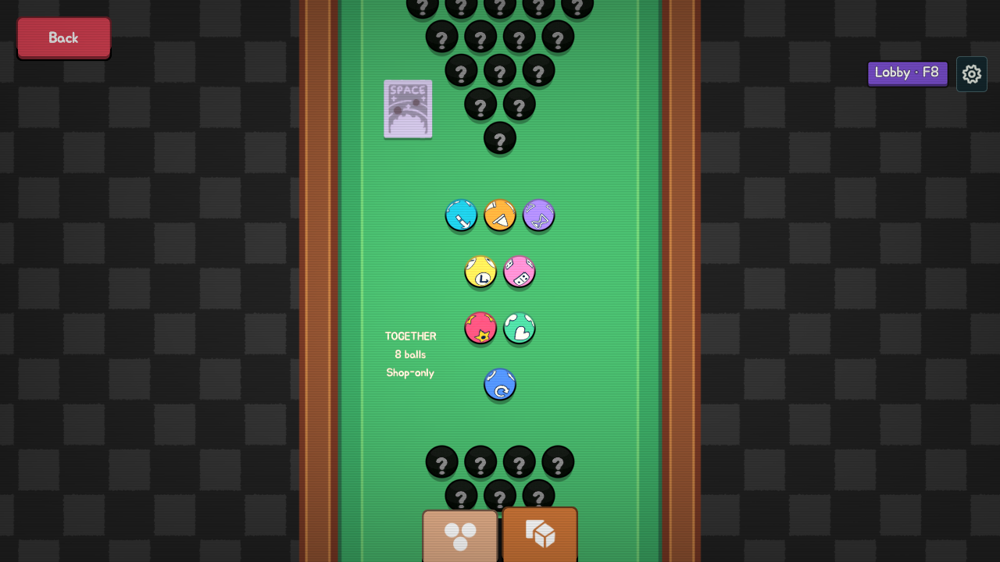
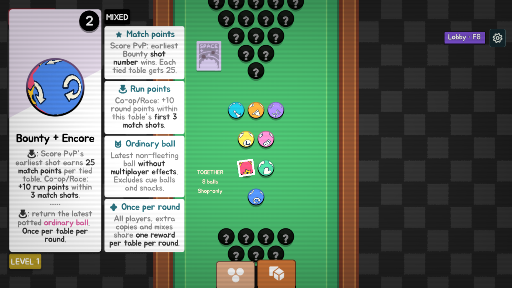
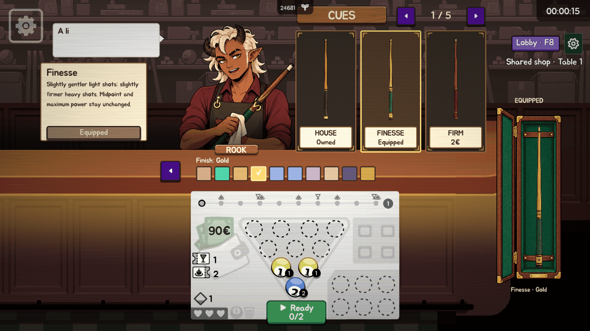

# Cue placard and Together collection — native evidence

Windows capture `20260927T121822Z-clean-cue-placard` at gameplay/fixture commit `9541e71` passed **2,797/2,797 checks**, including **610 collection checks**, and produced **90 native screenshots** plus **96 actual viewport animation frames**. One muted isolated process used the compatibility renderer, 1280×720, a 30 FPS cap and a 180-second watchdog. It exited normally in about 105 seconds with no script errors; normal saves and installed files were unchanged. Engine shutdown resource warnings remain.

The placard now shows the cue name, effect, shared bonus limit and action. The duplicate wallet line, personal/run label and idle instruction are removed. The native wallet remains visible below. Pending, rejection and affordability feedback remain available; run ownership and free switching are explained on hover.

All eight ball inspections, native rarity prices and highlighted descriptions, the four-helper Bounty/Encore mix, level badges, label/ball/tooltip bounds, retained outline geometry, no-overlap checks, unchanged discovery records, native tabs/scrolling and close/reopen passed. Rows are centered within the original native set footprint. Cue probes passed 226 catalog/curve, 206 inventory and 209 effect checks, including mixed-price spending and the shared bonus budget.

These are actual game renders. Generated artwork was integrated into the game; no mockup, generated animation frame, interpolation or composited UI appears in this evidence. The GIF preserves recorded draw timing subject to encoder time-base and GIF centisecond quantization.

This is native fixture rendering and callback evidence, not live networking or a foreground performance/balance measurement. Actual narrow-window rendering, macOS, controller hardware, simultaneous shoppers, delayed/reordered network updates and long-run balance remain open.

- [All 90 native screenshots and HTML gallery](complete-native-gallery.zip)
- [Verification](verification.json), [timing/state provenance](manifest.json), [encoding](encoding.json), [published file hashes](files.json)
- [Relay inspection](collection-together-relay.png)
- [Called Shot inspection](collection-together-called-shot.png)
- [Patience inspection](collection-together-patience.png)
- [Bankroll inspection](collection-together-bankroll.png)
- [Bounty inspection](collection-together-bounty.png)
- [Lifeline inspection](collection-together-lifeline.png)
- [Encore inspection](collection-together-encore.png)
- [Domino inspection](collection-together-domino.png)
