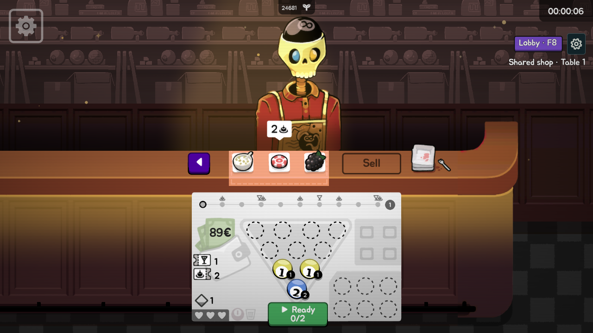
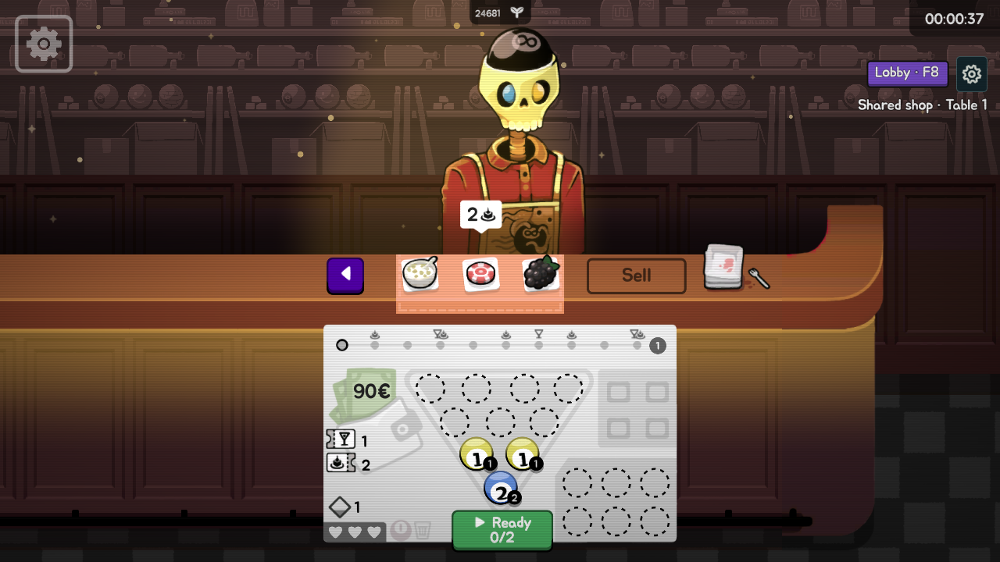
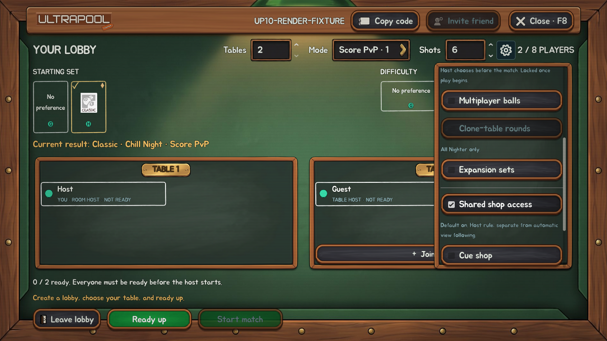

# Host cue-shop setting — native evidence

Capture `20260928T014725Z-cue-shop-setting` at `730d31fd560200bfe5783e55382070fadf141430` passed **2,895/2,895 checks** and produced **93 native screenshots**. One muted isolated process, compatibility renderer, 1280×720, 30 FPS, 180-second watchdog. No script errors; normal saves and installed files unchanged. Engine shutdown resource warnings remain.

The production host checkbox controls the frozen run setting. Checks cover default ON, host-only changes, readiness invalidation, guest/match locks, strict boolean configuration, native host/guest shops with cues OFF, absent rack/navigation/art extensions, refused purchases and local requests, ignored cue equipment snapshots, preserved native counters, and re-enabling the next shop session. Shot/effect fixtures cover native power and inactive perk hooks while OFF, then enabled handling and scoring again. The repeated match-start guard preserves an active run's frozen rule.

These are screenshots from the game, not generated mockups. Fixtures invoke production callbacks in one native process. Live Steam, remote table leaders, reconnect topology, macOS and measured performance/balance remain unverified. Separate transport-protocol tests are authored and parsed, not executed by this capture.

- [Complete native screenshot gallery](complete-native-gallery.zip)
- [Verification](verification.json), [published file hashes](files.json)

